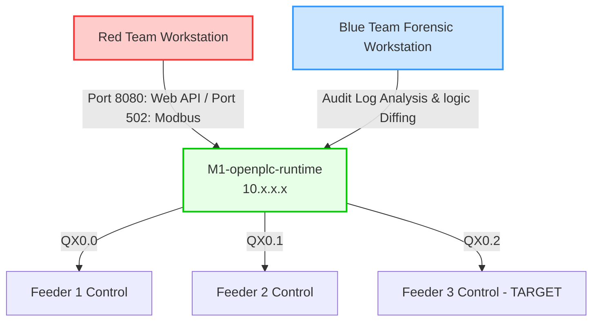

# Operation VAJRA SHAKTI: Red vs Blue Challenge

## Purple Team Exercise Scenario

Welcome to **Operation VAJRA SHAKTI**, a realistic OT/ICS cyber exercise. This lab simulates a critical infrastructure environment—a power distribution center's primary substation control system. 

> [!IMPORTANT]
> **Operational Context:**
> The plant runs OpenPLC to control three critical power distribution feeders. 
> * **Feeder 1 (%QX0.0)** & **Feeder 2 (%QX0.1)** must remain stable at all times.
> * **Feeder 3 (%QX0.2)** is the target of the degradation attack.

---

## Red Team Mission
* **Tactics:** TA0110 (Persistence) & T0889 (Modify Program)
* **Objective:** Pivot to the Engineering Workstation, access the OpenPLC Web Dashboard, and upload a tampered Structured Text program (`malicious.st`).
* **Goal:** Discreetly deploy a hidden timer routine that periodically forces Feeder 3 into a shed state (trip to `FALSE`) every 60–90 seconds while keeping Feeders 1 and 2 completely stable.

## Blue Team Mission
* **Tactics:** TA0115 (Threat Detection) & Incident Response
* **Objective:** Monitor the physical states of the registers, review application audit logs, export the running PLC configuration, and compare it against the known-good baseline.
* **Goal:** Identify the exact logic modification, the target coil, the download origin/timestamp, and the cryptographic hash mismatch to execute clean remediation.

---

## Workspace Navigation

* **Red Team Materials:**
  * Setup Script: [setup.sh](file:///home/newton/Hacktify/1_Hidden_Load_Shed_Timer_CTF/1_Hidden_Load_Shed_Timer_CTF/Module_1_Red/setup.sh)
  * Walkthrough Guide: [Red-Writeup.md](file:///home/newton/Hacktify/1_Hidden_Load_Shed_Timer_CTF/1_Hidden_Load_Shed_Timer_CTF/Module_1_Red/Red-Writeup.md)
  * Baseline ST: [baseline.st](file:///home/newton/Hacktify/1_Hidden_Load_Shed_Timer_CTF/1_Hidden_Load_Shed_Timer_CTF/Module_1_Red/engineering_baseline/baseline.st)
* **Blue Team Materials:**
  * Setup Script: [setup.sh](file:///home/newton/Hacktify/1_Hidden_Load_Shed_Timer_CTF/1_Hidden_Load_Shed_Timer_CTF/Module_2_Blue/setup.sh)
  * Walkthrough Guide: [Blue-Writeup.md](file:///home/newton/Hacktify/1_Hidden_Load_Shed_Timer_CTF/1_Hidden_Load_Shed_Timer_CTF/Module_2_Blue/Blue-Writeup.md)
  * Forensic Logs: [openplc_audit.log](file:///home/newton/Hacktify/1_Hidden_Load_Shed_Timer_CTF/1_Hidden_Load_Shed_Timer_CTF/Module_2_Blue/evidence_logs/openplc_audit.log)
